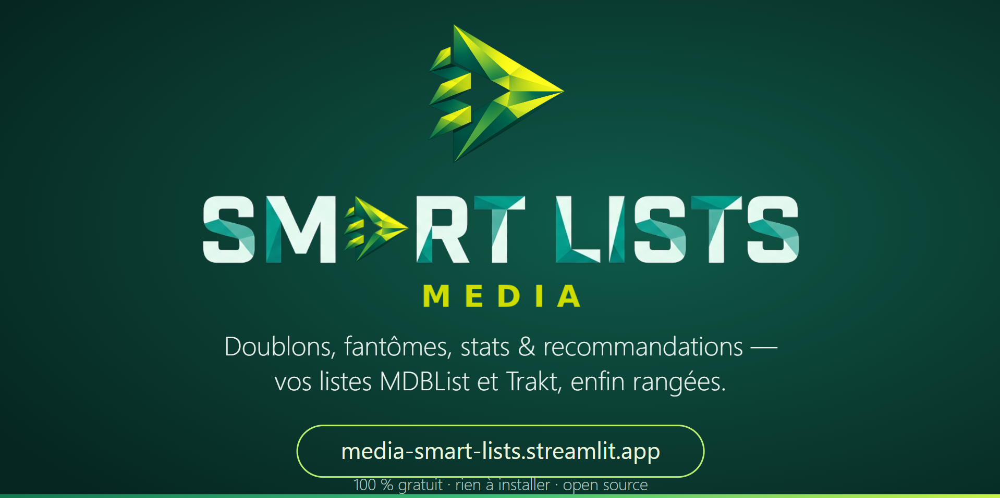

<div align="center">


**Range tes listes, retrouve tes séries en cours, et sache ENFIN quoi regarder ce soir.**

[](https://media-smart-lists.streamlit.app/)
[](https://www.python.org/)
[](https://streamlit.io/)
[](https://mdblist.com/)
[](LICENSE)

*Une application web Streamlit qui croise votre historique **MDBList** (ou votre export **ZIP Trakt**) avec vos listes, les nettoie, et vous recommande quoi regarder grâce à un score personnalisé et 100 % transparent. Interface en français.*

</div>

---

> 🎯 **Pour qui ?** En priorité pour les **utilisateurs MDBList**, mais aussi pour les **utilisateurs Trakt** qui veulent faire le ménage dans leurs listes : suite au renforcement des règles de Trakt (comptes gratuits), **Media Smart Lists** permet la lecture de vos données Trakt via votre export **ZIP Trakt** (voir plus bas comment l'obtenir).

## ✨ Les sources de données

Media Smart Lists est **fournisseur-neutre** : quelle que soit l'origine de vos données, toutes les pages fonctionnent à l'identique.

| Source | Description |
|---|---|
| 🔗 **MDBList (temps réel)** | Connectez votre compte MDBList (OAuth, sans mot de passe). Historique, Watchlist, listes, notes, progression, séries abandonnées sont chargées en temps réel, avec un **cache 1 h** pour économiser votre quota API. |
| 📦 **ZIP Trakt (local, lecture seule)** | Importez votre export ZIP Trakt (Settings → Your data → Export). Historique complet avec rewatches, notes, Watchlist, listes, reprises en pause — **sans aucune API Trakt**. Enrichissement optionnel par MDBList (genres, posters, durées, notes). |

## 🧭 Les 10 pages

### 🏠 Tableau de bord
Un badge indique clairement la source consultée (🔵 MDBList / 🟢 Trakt ZIP). Vous y trouvez : votre **rythme de visionnage** (épisodes/semaine, bilan du mois), vos **compteurs à vie** (heures séries / films), la **date de fin projetée** de vos séries en cours (hors abandonnées), le digest des 7 derniers jours et vos derniers visionnages.

### ▶️ En cours de lecture
Vos séries en cours avec leur progression : épisodes vus, temps de visionnage, temps restant, prochain épisode à regarder. Cartes aérées avec liens discrets (🔎 Où regarder · TMDB · MDBList).

### 👻 Progression Fantôme
Les reprises mises en pause : % de progression, durée restante, dernière activité. Filtres, tris et recherche locaux.

### 🧹 Nettoyage des listes
L'audit local de vos listes :
- **Vu · à retirer** (ajouté avant le visionnage → oublié de l'enlever) vs **Vu · à revoir** (ajouté après → remis exprès) ;
- **doublons** entre conteneurs (avec chevauchements et listes dynamiques) ;
- **suppression sécurisée** : cochez un contenu, choisissez l'action intelligente (retirer d'une liste précise, de la Watchlist, ou de tous les conteneurs), téléchargez une sauvegarde, confirmez ;
- **marquer vu / non-vu** et **abandonnée** (séries) ;
- historique des ajouts aux listes (date, conteneur, tri).

### 🎯 Que regarder ?
Le cœur de l'application. À partir de votre historique, l'app construit votre **profil de visionnage** (genres fétiches, durées préférées, décennies, pays, studios…). Ensuite chaque contenu de vos listes est **scoré sur 100 avec une explication transparente** : chaque pastille (⭐ Note communauté, 👥 Apprécié du public, 🌍 Cinéma, 🆕 Récent, ⏱️ Durée idéale, 💎 Pépite confidentielle, 📥 Tout juste ajouté, 🚪 Zéro effort, 🏢 Studio fétiche…) affiche son influence exacte au survol. **21 presets** (« Film rapide », « Soirée cinéma », « Presque finies », « Pépites confidentielles », « Hors zone de confort »…) et une **🎲 roulette** pour les indécis.

### 📅 Calendrier des sorties
Les sorties futures de **vos** contenus : films à venir, premières de séries, prochains épisodes annoncés. Trois sources fusionnées (calendrier MDBList, dates déjà dans vos données, appels groupés) sur des horizons jusqu'à **1 an et demi**, avec filtres, recherche, export CSV et ICS. Un panneau « Pourquoi ce calendrier… » explique chaque résultat.

### 📊 Statistiques
Des statistiques détaillées : **une seule série de filtres** (Période · Type · Genre) appliquée à toute la page, heatmap d'activité façon GitHub, heures par mois (triées chronologiquement), genres, répartition par heure/jour/année, ADN cinéphile, studios préférés, marathons, évolution des goûts. La vue d'ensemble en haut est explicitement « non filtrée ».

### 🎬 Rendez-vous annuel (Wrapped)
Votre récapitulatif annuel façon Spotify Wrapped : films, séries, épisodes, note moyenne, records, tops, genres, heures par mois — et une **image PNG 1080×1350 partageable** générée localement.

### 🏆 Succès
**61 badges** à débloquer : paliers de temps, films, épisodes, séries suivies, marathons, diversité, nocturne, rewatchs, rythme. Chaque badge verrouillé montre sa progression.

### 📤 Sauvegarde
- **Sauvegarde JSON** neutre et versionnée, **restaurable** même sans connexion ;
- **rapport Excel** multi-onglets (Résumé, Historique, Mes contenus, Listes, Statistiques, Badges) avec largeurs auto ;
- aucun secret ni jeton dans les exports.

## 🚀 Démarrage rapide

1. Ouvrez 👉 **[media-smart-lists.streamlit.app](https://media-smart-lists.streamlit.app/)**
2. Choisissez votre source :
   - **🔗 MDBList** : cliquez « Préparer la connexion MDBList » → autorisez avec le code affiché (ou le QR code), puis « Charger mes données MDBList » ;
   - **📦 ZIP Trakt** : cliquez « Préparer l'import ZIP Trakt » → suivez le guide (trakt.tv → Settings → Your data → Export) → déposez le ZIP.
3. Explorez les 10 pages. 🍿

## 🔒 Sécurité & confidentialité

- **Open source** : le code est lisible par tous sur GitHub ;
- connexion **OAuth directe** entre vous et MDBList (jamais de mot de passe) ;
- tokens chiffrés dans un cookie ; **aucun secret dans le dépôt** (`.streamlit/secrets.toml` est ignoré par git) ;
- les écritures (suppression, vu/non-vu, notes, abandon) ne se font **que sur vos clics, avec aperçu + sauvegarde + confirmation** ;
- import ZIP **lecture seule** : rien n'est modifié sur Trakt, le ZIP n'est pas conservé ;
- aucun serveur ne stocke vos données : tout est calculé dans votre navigateur/session.

## 📦 Installation locale (optionnel)

```bash
git clone https://github.com/Minijoe01/Media-Smart-Lists.git
cd Media-Smart-Lists
python -m venv .venv && source .venv/bin/activate   # Windows : .venv\Scripts\activate
pip install -r requirements.txt
cp .streamlit/secrets.example.toml .streamlit/secrets.toml
# Renseigne tes secrets (client MDBList + clé de chiffrement) puis :
streamlit run app.py
```

### Secrets requis (`.streamlit/secrets.toml`)

```toml
MDBLIST_CLIENT_ID = "…"          # client_id de ton app OAuth MDBList
MDBLIST_CLIENT_SECRET = "…"      # client_secret (optionnel selon le flux)
TOKEN_ENCRYPTION_KEY = "…"       # clé Fernet 32 octets (base64 url-safe)
```

> 🔑 Jamais de vraies clés sur GitHub. Utilisez `.streamlit/secrets.example.toml` comme modèle.

## 🧱 Architecture

```text
MDBListProvider ──┐
                  ├── NormalizedDataset ── UI commune (10 pages)
TraktZipProvider ─┘
```

- `app.py` : toute l'interface + logigramme du tableau de bord + enrichissement ZIP ;
- `mdblist_oauth.py` : OAuth device code, cookies, session ;
- `mdblist_provider.py` : appels API MDBList (lecture + écritures sécurisées) ;
- `trakt_zip_provider.py` : import ZIP Trakt sécurisé (zip-slip, tailles) ;
- moteurs : `recommendation_engine.py`, `stats_engine.py`, `achievements_engine.py`, `wrapped_engine.py`, `dashboard_engine.py`, `excel_export.py`, `list_audit_engine.py`, `calendar_engine.py`, `history_engine.py`, `normalized_model.py`.

## 📖 Documentation

- [Changelog](CHANGELOG.md) — les versions de l'application ;
- [TODO / feuille de route](MEDIA-SMART-LISTS-TODO.md) ;
- [Dossier de reprise IA](AI-HANDOFF.md) ;
- [Guide communauté Alkodiques](docs/guide-alkodiques.md) — article d'annonce.

## 📸 Captures



## 🐛 Bugs, idées, envies ?

Les [issues GitHub](https://github.com/Minijoe01/Media-Smart-Lists/issues) sont ouvertes. Proposez une amélioration, signalez un bug, ou venez en parler.

**Bonne analyse… et surtout : bon visionnage ! 🍿**
