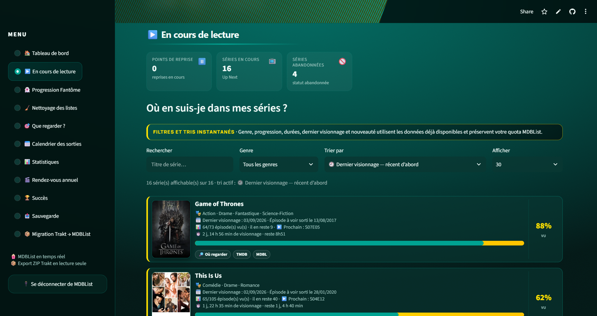
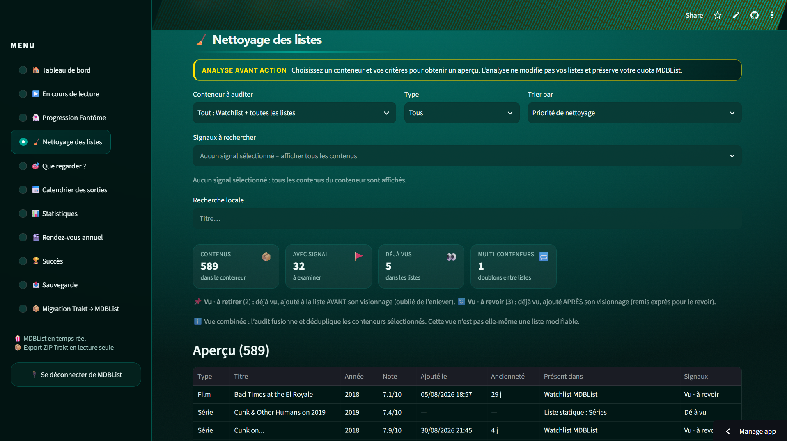
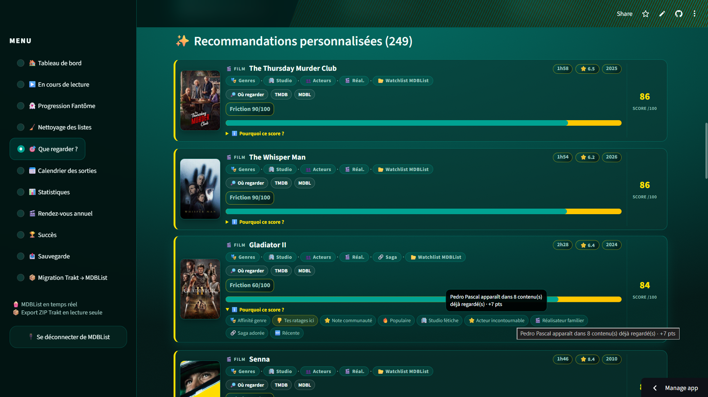
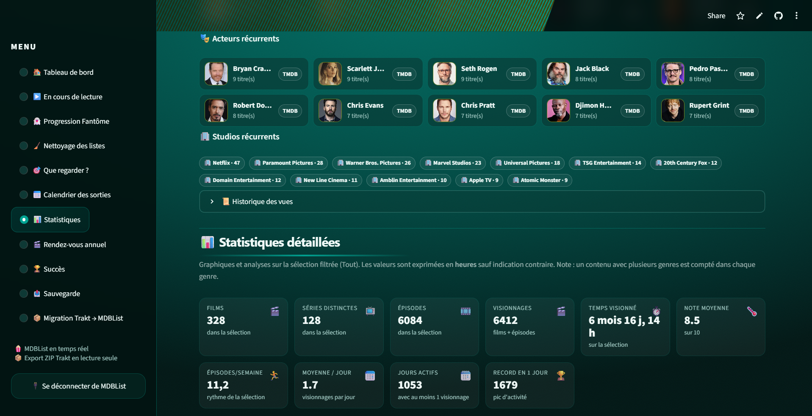
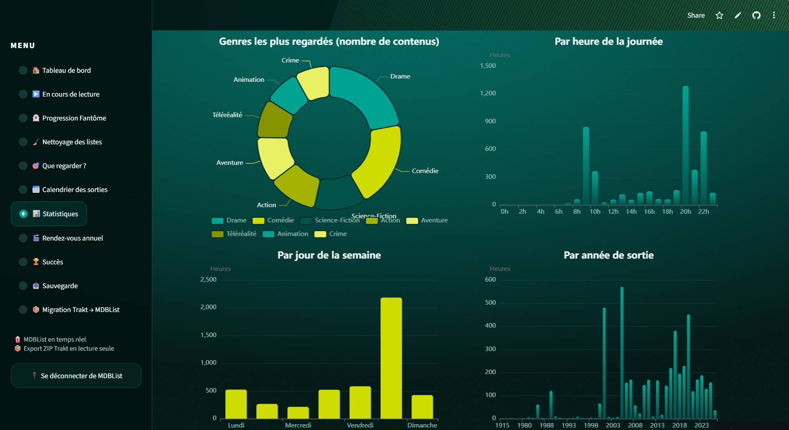

<div align="center">


**Range tes listes, retrouve tes séries en cours, et sache ENFIN quoi regarder ce soir.**

[](https://media-smart-lists.streamlit.app/)
[](https://www.python.org/)
[](https://streamlit.io/)
[](https://mdblist.com/)
[](LICENSE)

*Une application web Streamlit qui croise votre historique **MDBList** (ou votre export **ZIP Trakt**) avec vos listes, les nettoie, et vous recommande quoi regarder grâce à un score personnalisé et 100 % transparent. Interface en français.*

</div>

---

> 🎯 **Pour qui ?** En priorité pour les **utilisateurs MDBList**, mais aussi pour les **utilisateurs Trakt** qui veulent faire le ménage dans leurs listes : suite au renforcement des règles de Trakt (comptes gratuits), **Media Smart Lists** permet la lecture de vos données Trakt via votre export **ZIP Trakt** (voir le tuto plus bas).

## 🤔 Le problème

Tu as des listes qui débordent, une watchlist dans tous les sens, et tu ne sais plus :

- ce que tu as **déjà vu** qui traîne encore dans tes listes ;
- quels contenus sont **en double** d'une liste à l'autre ;
- où sont passés ces films « repris plus tard » bloqués dans *Continuer à regarder* (les **fantômes** 👻 — les mêmes qui polluent ton widget « En cours » dans Kodi) ;
- et surtout… **quoi regarder ce soir** sans scroller 40 minutes.

Media Smart Lists répond à tout ça, en une analyse.

## ✨ Fonctionnalités

| Page | Ce qu'elle fait |
|---|---|
| 🏠 **Tableau de bord** | Badge de source (🔵 MDBList / 🟢 Trakt ZIP), vue d'ensemble, digest de la semaine, **⏱️ ton rythme** (récap du mois, ép./semaine, compteurs à vie, **date de fin projetée** 📅), derniers visionnages 🕘. Ruban compte/quota MDBList toujours visible |
| ▶️ **En cours de lecture** | Tes séries en cours : %, temps vu/restant, **prochain épisode SxxEyy**, affiches, liens (Où regarder / TMDB / MDBList). Cartes aérées |
| 👻 **Progression Fantôme** | Les reprises mises en pause : progression réelle, temps restant, dernière activité — avec **suppression directe** du scrobble fantôme |
| 🧹 **Nettoyage des listes** | Retire les contenus déjà vus, avec garde-fou intelligent : distinction **ajouté avant le visionnage** (= à retirer) vs **ajouté après** (= tu veux le revoir, on le garde). **Doublons entre listes**, **suppression sécurisée** (aperçu + sauvegarde + confirmation), marquer vu / non-vu / abandonnée |
| 🎯 **Que regarder ?** | Filtres **Genres / Styles / Presets** (voir le mode d'emploi ci-dessous), score personnel **100 % explicable** (/100 + indice de friction 🚪), pastilles à infobulles, **🎲 2 roulettes**, **🎯 recherche « Hors de mes listes »** sur tout TMDB, **🔖 signets de recherche partageables** |
| 📅 **Calendrier des sorties** | Les prochaines sorties de TES contenus : films, premières de séries, prochains épisodes — horizons jusqu'à **1 an et demi**, export CSV/ICS |
| 📊 **Statistiques** | Heatmap façon GitHub, heures par mois, genres, répartition jour/heure/année, ADN cinéphile, studios, marathons, **« Mes contenus notés »** ⭐ (retrouve tes 10/10), évolution des goûts — une seule série de filtres partout |
| 🎬 **Rendez-vous annuel** | Ton « Wrapped » perso + **image PNG partageable** |
| 🏆 **Succès** | **61 badges** à débloquer (marathons, streaks 🔥, rewatch master ♾️, nocturne 🌙…) |
| 📤 **Sauvegarde** | Export/import **JSON** complet + **rapport Excel** multi-onglets |
| 📦 **Migration Trakt → MDBList** | Migre ton export ZIP Trakt vers MDBList **sans Python ni clé API** : historique (vraies dates), notes, Watchlist, listes. **Mode simulation par défaut** |

---

## 🎯 « Que regarder ? » — le mode d'emploi

C'est le cœur de l'app. La page filtre **tes listes** et peut aussi chercher **dans tout TMDB** (« hors de mes listes »). Voici comment elle est organisée.

### Les 3 familles de critères — et laquelle choisir

La page propose **trois niveaux de sélection**, du plus large au plus pragmatique :

| | 🏷️ **Genres** | 🎭 **Styles & ambiances** | 💡 **Presets** |
|---|---|---|---|
| **C'est quoi ?** | La classification officielle TMDB (une douzaine par fiche) | **91 styles** basés sur les **mots-clés TMDB**, bien plus fins que les genres | **25 combinaisons prêtes à l'emploi** |
| **Exemples** | 💥 Action, 😱 Horreur, ❤️ Romance, 🚀 Science-fiction… | 🧠 Mindfuck, 🩸 Gore, 🏁 Formule 1, 🛡️ Peplum, 📸 Mockumentaire, 🏔️ Montagne, 🔍 Polar, 🎮 Jeux vidéo, 🎅 Noël… | ⚡ Rapide — film < 1h30 · 📺 Binge express · 🍿 Soirée cinéma · 📚 Suite d'une saga entamée · 🌟 Acteur incontournable… |
| **Granularité** | Grande famille du contenu | Thème précis (un contenu peut en porter plusieurs) | **Raccourci multi-critères** (durée + type + note + profil…) |
| **Tu l'utilises quand…** | « Je veux un film d'horreur » | « Un found footage avec des fantômes » · « un docu sur la F1 » | « Je n'ai qu'une heure et demie ce soir » · « finis-moi une mini-série » |

**La différence en une phrase** : un **genre** classe le contenu, un **style** décrit sa saveur (mot-clé TMDB), un **preset** est une **combinaison** de critères qui répond à une envie du soir — il ne duplique jamais un genre ni un style.

Exemple concret — envie d'horreur ce soir :
1. 🏷️ Genre **Horreur** → tous tes contenus d'horreur ;
2. + 🎭 Styles **Found footage** et **Fantômes** → plus que le found footage spectral ;
3. + 💡 Preset **Zéro effort ce soir** → seulement ce qui se lance sans engagement.

Les trois familles se **combinent librement** (en ET entre elles).

### 🏷️ Genres — inclure et exclure

- **Inclusion** : plusieurs genres possibles, avec le mode **« Au moins un (OU) »** ou **« Tous (ET) »** ;
- **🚫 Exclusion** : une seconde liste pour barrer les genres dont tu ne veux pas entendre parler ;
- chaque genre affiche **son icône** (😂 Comédie, 😱 Horreur, 🤠 Western, 🏅 Sport…) ;
- 🧠 malin : les genres sans équivalent TMDB sont traduits automatiquement (filtrer **Biographie** trouve aussi les contenus taggés **Histoire** ; **Sport** cherche le mot-clé TMDB « sports »…).

### 👥 Acteurs, 🎬 réalisateur, 🏢 studios, 🌍 pays

- **👥 Acteurs** : plusieurs possibles, mode **OU** (au moins un) ou **ET** (tous), la liste est celle de TES contenus (zéro appel API) ;
- **🎬 Réalisateur** et **🏢 Studios** : même logique ;
- **🌍 Pays d'origine** : à inclure et/ou à exclure (🚫 USA pour du cinéma du monde, par exemple).

### 🔍 Filtres & tri

L'expander **🔍 Filtres** regroupe durée minimum, temps max, années de sortie, note minimum et statut des séries. L'expander **🔃 Tri & affichage** propose 16 tris (dont **✨ Pour moi (recommandé)**, le score perso) et le nombre de cartes affichées.

### 🧠 Le score : comment tes chouchous et tes sagas sont récompensés

Chaque carte affiche un score /100 **totalement explicable** (survole une pastille pour voir son influence exacte). Les mécanismes clés :

**Tes acteurs / réalisateurs / studios favoris** — détectés automatiquement dans ton historique (vu au moins 2 fois, et pas déçu en moyenne) :

| Situation | Pastille sur la carte | Points |
|---|---|---|
| Acteur croisé 2 fois | 🎭 Visage familier | +3 |
| Acteur croisé 3-4 fois | ⭐ Acteur incontournable | +5 à +7 |
| Acteur croisé 5 fois et + | ⭐ Acteur incontournable | +7 à **+9** |
| Réalisateur vu 5 fois et + | 🎬 Réalisateur de confiance | +5 à +9 |
| Studio déjà bien exploré | 🏢 Studio fétiche | +3 à +9 |

Un seul navet ne « sacque » pas un favori : la moyenne ignore la note la plus basse (pas d'effet domino).

**Tes sagas** — le candidat appartient à une collection que tu as commencée :

| Ta saga | Pastille | Points |
|---|---|---|
| Commencée (1 film vu) | 🔗 Saga commencée | +3 « pour la finir » |
| Commencée (2 films et +) | 🔗 Saga commencée | +4 |
| Tu l'as notée ≥ 7/10 | 🔗 Saga adorée | +5 à +6 |
| Tu l'as notée < 5/10 | 👎 Saga déçue | **−12** (les suites sont pénalisées) |

**Le reste du barème** : affinité avec tes genres (jusqu'à +28, pondérée par la **récence** de tes goûts), tes **notes personnelles** par genre (+8 si tu notes ce genre haut, −6 si tu le notes bas), note de la communauté (bonus jusqu'à +25 au-delà de 5.5, **malus** en dessous), durée idéale calculée sur TES visionnages, fraîcheur d'ajout dans la liste (un contenu oublié 2 ans est pénalisé), format court favorisé après 22 h…

### 🎯 « Hors de mes listes » — découvrir dans tout TMDB

Remplis tes critères (recherche, genres, styles, preset, acteurs, réalisateur, studio, pays, époque, durée, statut, note…) puis clique sur le bouton **« 🎯 Hors de mes listes »** : la recherche part dans un **grand bassin TMDB** (filmographies complètes de tes acteurs, suites de tes sagas, recherche par titre, découverte diversifiée), puis chaque résultat est **scoré par TON profil**. Trois sections :

- **🎯 Propositions parfaites** — tout respecte ;
- **✨ Pas parfait, mais ça pourrait te plaire** — un seul critère manque, indiqué par la pastille 🧩 ;
- **👀 Déjà vu, mais ça correspond** — des vus de plus d'un an qui collent à ta demande (idéal rewatch).

Et avec **« ➕ Ajouter une découverte à mes listes »**, tu ranges le bon trouveau directement dans ta **Watchlist** ou une de tes **listes statiques** MDBList — sans quitter l'app.

### 🎲 Roulettes et 🔖 signets

- **🎲 Roulette — choisir pour moi** : le hasard tranche parmi tes contenus bien notés ; **🧭 Roulette découverte** pousse hors des sentiers battus ;
- **🔖 Signets de recherche** : mémorise une combinaison de filtres sous un nom, recharge-la en un clic (**📌 Charger**), copie un **lien 🔗** qui la restaure sur n'importe quel appareil, ou partage **tous tes signets d'un coup** (📤).

### ⏳ Et pendant ce temps, TMDB travaille

Au premier chargement, l'app affiche tes listes **immédiatement** (données MDBList seules) puis **enrichit en arrière-plan** : genres complets, acteurs, réalisateurs, studios, mots-clés (les styles !), pays, certifications… Sans bloquer l'interface.

## ⚡ Pourquoi c'est rapide

- **Cache persistant (1 h)** : données chargées une fois, rechargées depuis le cache au F5 — 0 appel API ;
- **Enrichissement TMDB en arrière-plan** : tes listes s'affichent tout de suite, les métadonnées arrivent ensuite sans bloquer ;
- **Appels groupés** (200 identifiants max par appel), jamais un appel par carte ;
- Statistiques, Succès, Wrapped : **0 appel API** supplémentaire ;
- Import ZIP Trakt **100 % local**.

## 📸 Captures d'écran

<p align="center"></p>
<p align="center"></p>
<p align="center"></p>
<p align="center"></p>
<p align="center"></p>
<p align="center"></p>

## 🚀 Utiliser l'app

👉 **[media-smart-lists.streamlit.app](https://media-smart-lists.streamlit.app/)** — choisis ta source, c'est parti.

### 🔗 Connexion directe MDBList (recommandée)

1. Clique sur **« Préparer la connexion MDBList »** ;
2. autorise avec le **code affiché** (ou scanne le **QR code** avec ton téléphone) ;
3. clique sur **« Charger mes données MDBList »**.

> Le cache d'une heure évite de recharger et de consommer ton quota à chaque visite.

### 📦 Import de ton ZIP Trakt (local, lecture seule)

Tu as encore un compte Trakt ? Trakt reste utilisable **via un fichier ZIP**, sans aucune API :

1. Va sur **[app.trakt.tv/settings/data?mode=media](https://app.trakt.tv/settings/data?mode=media)** et connecte-toi ;
2. scrolle jusqu'à la section **« Export »** ;
3. clique sur **« Exporter maintenant »** — comptez **quelques minutes** ;
4. télécharge le fichier `export-trakt-*.zip` ;
5. dans Media Smart Lists : **« Préparer l'import ZIP Trakt »** → dépose le ZIP → **« Importer et charger mes données »**.

> 🔒 L'import est **100 % local et en lecture seule** : rien n'est modifié sur Trakt. En option (si connecté à MDBList), l'app peut **enrichir** tes données ZIP.

### 🚚 Migration ZIP Trakt → MDBList

Basculer définitivement sur MDBList en récupérant ton historique Trakt ? La page **« 📦 Migration Trakt → MDBList »** le fait en ligne, sans Python ni clé API : aperçu (avec les **vraies dates de visionnage**), sections au choix, **mode simulation par défaut**, sauvegarde JSON, écriture par lots et **rapport Excel final**.

> ⚠️ Écriture massive : l'aperçu, la sauvegarde et la confirmation sont obligatoires. Essaie d'abord en **mode simulation** — aucun POST n'est envoyé.

## 🛠️ Lancer en local

```bash
git clone https://github.com/Minijoe01/Media-Smart-Lists.git
cd Media-Smart-Lists
python -m venv .venv && source .venv/bin/activate   # Windows : .venv\Scripts\activate
pip install -r requirements.txt
cp .streamlit/secrets.example.toml .streamlit/secrets.toml
```

Renseigne `.streamlit/secrets.toml` :

```toml
MDBLIST_CLIENT_ID = "ton_client_id"
MDBLIST_CLIENT_SECRET = "ton_client_secret"   # optionnel selon le flux
TOKEN_ENCRYPTION_KEY = "une_clé_fernet_32_octets"
```

```bash
streamlit run app.py
```

## ☁️ Déployer ta propre instance (Streamlit Cloud)

1. Fork ce repo sur ton compte GitHub.
2. Sur [share.streamlit.io](https://share.streamlit.io) : **New app** → ton repo, branche `main`, fichier `app.py`.
3. Dans **Settings → Secrets**, colle le même bloc TOML que ci-dessus.
4. Deploy. 🎉

## 🔒 Vie privée

- Aucune base de données, aucun compte à créer : l'authentification se fait directement entre toi et **MDBList** (OAuth device flow), ou via ton **ZIP Trakt** local.
- Les jetons ne quittent jamais le serveur Streamlit / ton navigateur, et ne sont **jamais** inclus dans les exports.
- Les données sont mises en cache (cloisonné par utilisateur) uniquement pour accélérer tes visites suivantes.
- Les écritures ne se font **que sur action explicite + confirmation**.
- 👉 [Politique de confidentialité complète](docs/privacy.md) · [Politique de sécurité (SECURITY.md)](SECURITY.md)

## 💬 Communauté

- 🐛 **Un bug, une idée ?** → [Ouvre une issue](https://github.com/Minijoe01/Media-Smart-Lists/issues)
- 💡 Discussions & entraide → onglet **Discussions** du repo
- 🤝 Tu veux contribuer ? Fork → branche → Pull Request.

## 🙏 Attributions & remerciements

- Données : **[MDBList](https://mdblist.com)** (API) et **Trakt** (via export ZIP local)
- Affiches et métadonnées : **[TMDB](https://www.themoviedb.org/)** via MDBList
- Construit avec [Streamlit](https://streamlit.io), Apache ECharts, la police [Manrope](https://github.com/sharanda/manrope) (OFL) et beaucoup d'amour pour le cinéma et les séries.

---

**Bonne analyse… et surtout : bon visionnage ! 🍿**
