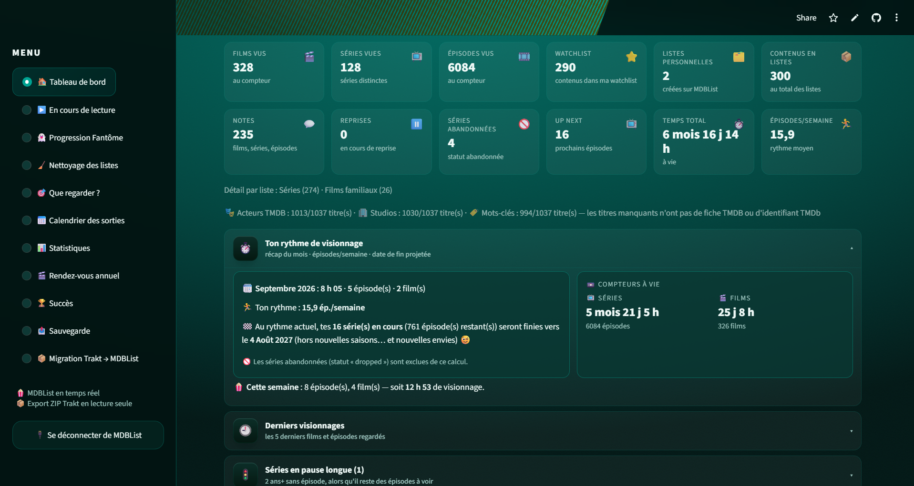
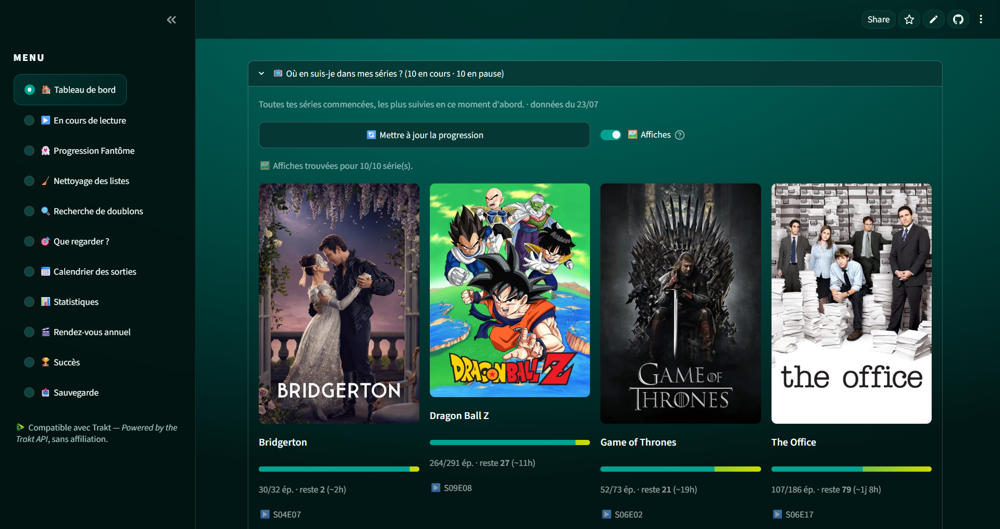
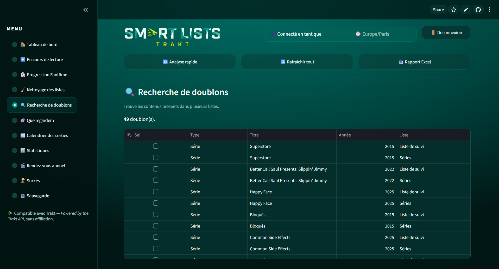
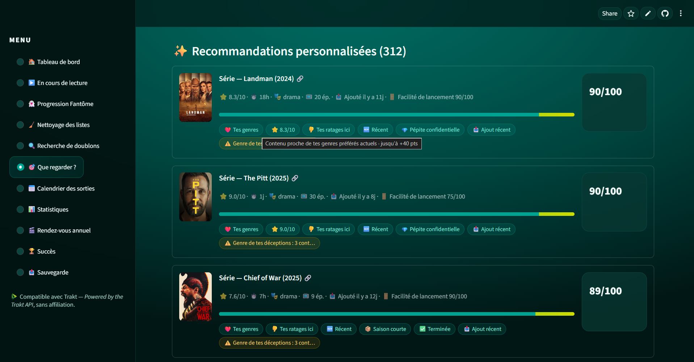
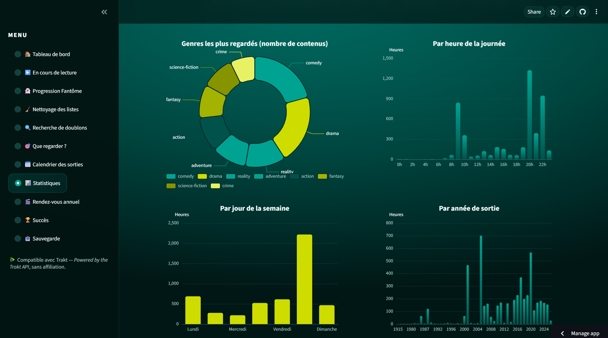

<div align="center">


**Range tes listes, retrouve tes séries en cours, et sache ENFIN quoi regarder ce soir.**

[](https://media-smart-lists.streamlit.app/)
[](https://www.python.org/)
[](https://streamlit.io/)
[](https://mdblist.com/)
[](LICENSE)

*Une application web Streamlit qui croise votre historique **MDBList** (ou votre export **ZIP Trakt**) avec vos listes, les nettoie, et vous recommande quoi regarder grâce à un score personnalisé et 100 % transparent. Interface en français.*

</div>

---

> 🎯 **Pour qui ?** En priorité pour les **utilisateurs MDBList**, mais aussi pour les **utilisateurs Trakt** qui veulent faire le ménage dans leurs listes : suite au renforcement des règles de Trakt (comptes gratuits), **Media Smart Lists** permet la lecture de vos données Trakt via votre export **ZIP Trakt** (voir le tuto plus bas).

## 🤔 Le problème

Tu as des listes qui débordent, une watchlist dans tous les sens, et tu ne sais plus :

- ce que tu as **déjà vu** qui traîne encore dans tes listes ;
- quels contenus sont **en double** d'une liste à l'autre ;
- où sont passés ces films « repris plus tard » bloqués dans *Continuer à regarder* (les **fantômes** 👻 — les mêmes qui polluent ton widget « En cours » dans Kodi) ;
- et surtout… **quoi regarder ce soir** sans scroller 40 minutes.

Media Smart Lists répond à tout ça, en une analyse.

## ✨ Fonctionnalités

| Page | Ce qu'elle fait |
|---|---|
| 🏠 **Tableau de bord** | Badge de source (🔵 MDBList / 🟢 Trakt ZIP), vue d'ensemble, digest de la semaine, **⏱️ ton rythme** (récap du mois, ép./semaine, compteurs à vie, **date de fin projetée** 📅), derniers visionnages 🕘. Ruban compte/quota MDBList toujours visible |
| ▶️ **En cours de lecture** | Tes séries en cours : % , temps vu/restant, **prochain épisode SxxEyy**, affiches, liens (Où regarder / TMDB / MDBList). Cartes aérées |
| 👻 **Progression Fantôme** | Les reprises mises en pause : progression réelle, temps restant, dernière activité — avec liens discrets |
| 🧹 **Nettoyage des listes** | Retire les contenus déjà vus, avec garde-fou intelligent : distinction **ajouté avant le visionnage** (= à retirer) vs **ajouté après** (= tu veux le revoir, on le garde). **Identifie et supprime les doublons entre listes** (le même contenu dans plusieurs conteneurs, avec retrait ciblé ou global). **Suppression sécurisée** (choisis le contenu → actions intelligentes selon les listes où il se trouve → sauvegarde + confirmation), **marquer vu / non-vu / abandonnée** |
| 🎯 **Que regarder ?** | Score personnel **100 % explicable** (/100 + indice de friction 🚪), **21 presets** d'humeur, roulette 🎲, pastilles à infobulles (⭐ note, 👥 public, 🌍 pays, 🆕 récent, ⏱️ durée, 💎 pépite, 📥 ajouté, 🏢 studio…) |
| 📅 **Calendrier des sorties** | Les prochaines sorties de TES contenus : films, premières de séries, prochains épisodes — horizons jusqu'à **1 an et demi**, export CSV/ICS, panneau « Pourquoi ce calendrier… » |
| 📊 **Statistiques** | Heatmap façon GitHub, heures par mois, genres, répartition jour/heure/année, ADN cinéphile, studios, marathons, évolution des goûts — **une seule série de filtres** (période, genre, type) appliquée partout |
| 🎬 **Rendez-vous annuel** | Ton « Wrapped » perso + **image PNG partageable** générée à la volée |
| 🏆 **Succès** | **61 badges** à débloquer (marathons, streaks 🔥, rewatch master ♾️, nocturne 🌙…) |
| 📤 **Sauvegarde** | Export/import **JSON** complet (restaurable même sans connexion) + **rapport Excel** multi-onglets |

### 🎯 Le score « Que regarder ? » : transparent et personnel

Pas de boîte noire. Chaque recommandation affiche **pourquoi** elle est là, en points :

- ❤️ Tes genres (pondérés par **récence** — tes goûts d'il y a 2 ans pèsent moins)
- 🫶 Les genres que TOI tu notes haut… et **👎 tes propres ratages** (genre déjà noté ≤ 3/10 chez toi → léger doute, jamais éliminatoire)
- ⏱️ Ta durée idéale, calculée sur TES films réellement regardés
- 🌍 Tes pays de cinéma de prédilection · 🆕 Toute récente · 🏁 Presque finie
- ⏳ « Déjà commencée, il te reste X ép. » · ▶️ « En pause chez toi »
- 🔄 Anti-saturation **douce** (suggère de varier, ne pénalise jamais)
- 🌙 Contenus courts favorisés après 22 h
- 🚪 **Indice de friction** : la « facilité de lancement » ce soir, à côté du score

Et pour choisir en 1 clic : **21 presets** (⚡ Rapide · 🍿 Soirée cinéma · 📺 Binge express · 🎯 Presque finies · 💎 Pépites confidentielles · 😄 Rire · 😱 Frissons · 🌍 Cinéma du monde · 🧭 Hors zone de confort…).

## ⚡ Pourquoi c'est rapide

- **Cache persistant (1 h)** : les données MDBList sont chargées une fois, puis rechargées depuis le cache au F5 — **0 appel API** à chaque visite
- **Enrichissement par lots** : genres, posters, durées, notes sont récupérés par **appels groupés** (200 identifiants max par appel), jamais un appel par carte
- « Que regarder ? », Statistiques, Succès, Wrapped puisent dans les données **déjà chargées** : 0 appel API de plus
- Les rapports (Excel, PNG) ne se génèrent **qu'au clic** ; le calendrier fusionne officiel + local + appels groupés avec diagnostics
- Import ZIP Trakt **100 % local** : aucune API, aucun rechargement

## 📸 Captures d'écran

<p align="center"></p>
<p align="center"></p>
<p align="center"></p>
<p align="center"></p>
<p align="center"></p>

## 🚀 Utiliser l'app

👉 **[media-smart-lists.streamlit.app](https://media-smart-lists.streamlit.app/)** — choisis ta source, c'est parti.

### 🔗 Connexion directe MDBList (recommandée)

1. Clique sur **« Préparer la connexion MDBList »** ;
2. autorise avec le **code affiché** (ou scanne le **QR code** avec ton téléphone) ;
3. clique sur **« Charger mes données MDBList »**.

> Le cache d'une heure évite de recharger et de consommer ton quota à chaque visite.

### 📦 Import de ton ZIP Trakt (local, lecture seule)

Tu as encore un compte Trakt ? Trakt reste utilisable **via un fichier ZIP**, sans aucune API. Voici comment obtenir ce ZIP :

1. Va sur **[app.trakt.tv/settings/data?mode=media](https://app.trakt.tv/settings/data?mode=media)** et connecte-toi ;
2. scrolle jusqu'à la section **« Export »** ;
3. clique sur **« Exporter maintenant »** — comptez **quelques minutes** (Trakt prépare l'export) ;
4. télécharge le fichier `export-trakt-*.zip` ;
5. dans Media Smart Lists : **« Préparer l'import ZIP Trakt »** → dépose le ZIP → **« Importer et charger mes données »**.

> 🔒 L'import est **100 % local et en lecture seule** : rien n'est modifié sur Trakt, le ZIP n'est pas conservé. En option (si connecté à MDBList), l'app peut **enrichir** tes données ZIP avec les métadonnées MDBList (genres, posters, durées, notes).

> ⚠️ L'app **écrit sur ton compte MDBList** uniquement quand tu cliques sur un bouton (suppression, vu/non-vu, abandon) — avec **aperçu, sauvegarde de sécurité et confirmation** à chaque fois. Elle ne partage rien avec personne.

## 🛠️ Lancer en local

```bash
git clone https://github.com/Minijoe01/Media-Smart-Lists.git
cd Media-Smart-Lists
python -m venv .venv && source .venv/bin/activate   # Windows : .venv\Scripts\activate
pip install -r requirements.txt
cp .streamlit/secrets.example.toml .streamlit/secrets.toml
```

Renseigne `.streamlit/secrets.toml` :

```toml
MDBLIST_CLIENT_ID = "ton_client_id"
MDBLIST_CLIENT_SECRET = "ton_client_secret"   # optionnel selon le flux
TOKEN_ENCRYPTION_KEY = "une_clé_fernet_32_octets"
```

```bash
streamlit run app.py
```

## ☁️ Déployer ta propre instance (Streamlit Cloud)

1. Fork ce repo sur ton compte GitHub.
2. Sur [share.streamlit.io](https://share.streamlit.io) : **New app** → ton repo, branche `main`, fichier `app.py`.
3. Dans **Settings → Secrets**, colle le même bloc TOML que ci-dessus.
4. Deploy. 🎉

Le dossier `fonts/` (polices DejaVu) garantit les accents sur l'image Wrapped PNG ; `static/fonts/` embarque la police **Manrope** de l'en-tête ; `static/wordmark.png` sert d'en-tête.

## 🔒 Vie privée

- Aucune base de données, aucun compte à créer : l'authentification se fait directement entre toi et **MDBList** (OAuth device flow), ou via ton **ZIP Trakt** local.
- Les jetons ne quittent jamais le serveur Streamlit / ton navigateur, et ne sont **jamais** inclus dans les exports.
- Les données sont mises en cache (cloisonné par utilisateur) uniquement pour accélérer tes visites suivantes.
- Les écritures (suppressions, vu/non-vu, abandon) ne se font **que sur action explicite + confirmation**, élément par élément.

## 💬 Communauté

- 🐛 **Un bug, une idée ?** → [Ouvre une issue](https://github.com/Minijoe01/Media-Smart-Lists/issues)
- 💡 Discussions & entraide → onglet **Discussions** du repo
- 🤝 Tu veux contribuer ? Fork → branche → Pull Request. Les PR sont lues et triées par le mainteneur.

## 🙏 Attributions & remerciements

- Données : **[MDBList](https://mdblist.com)** (API) et **Trakt** (via export ZIP local)
- Affiches et métadonnées : **[TMDB](https://www.themoviedb.org/)** via MDBList
- Construit avec [Streamlit](https://streamlit.io), Apache ECharts, la police [Manrope](https://github.com/sharanda/manrope) (OFL) et beaucoup d'amour pour le cinéma et les séries.

---

**Bonne analyse… et surtout : bon visionnage ! 🍿**
